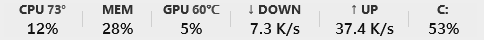
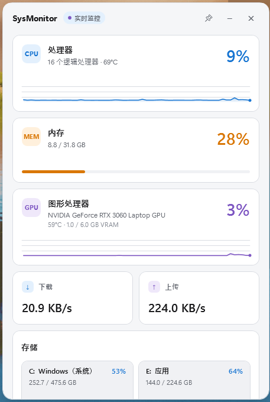
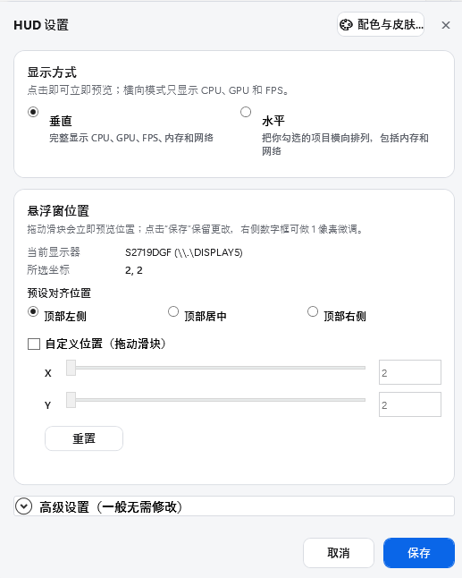
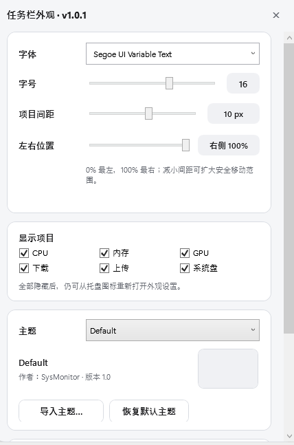
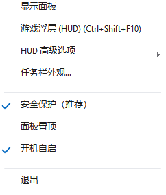

# SysMonitor

[](https://github.com/Oscar9527/SysMonitor/releases)
[](LICENSE)
[](https://github.com/Oscar9527/SysMonitor)

**SysMonitor** 是一款轻量、优雅、高性能的 Windows 任务栏系统性能监视器与游戏帧率浮层工具。将 CPU、内存、GPU、温度、网络速率和系统盘使用率直接无缝嵌入任务栏中，并提供现代化极简圆角详情面板与专业级游戏监控浮层（HUD）。

---

## 🌟 核心特性

- **任务栏状态栏 (Taskbar Band)**：无边框透明设计，原生嵌入 Windows 任务栏，实时显示 CPU/GPU 占用与温度、内存、上传/下载速率与磁盘使用率，不抢焦点、不占 Alt+Tab。
- **现代化详情面板 (Detail Panel)**：全新 16px 抗锯齿圆角卡片，现代悬浮胶囊滚动条，自适应多列存储空间展示，点击任务栏监控条自动在正上方弹出。
- **游戏监控浮层 (HUD)**：
  - 支持 `Ctrl+Shift+F10` 全局快捷键一键唤出；
  - 经典 MSI Afterburner 单行纯色风格与 Consolas 字体，无损呈现 GPU、CPU、RAM、FPS 等指标；
  - 支持顶部左侧、居中、右侧预设对齐与像素级拖动滑块微调，多显示器坐标独立记忆；
  - 全局显示器基准定位，自动过滤浏览器与日常桌面工具，全屏/窗口化/切屏/最小化均稳如磐石；
  - 双通道帧率引擎：可选读取 RTSS 共享内存，否则使用内嵌 PresentMon 2.5.1 ETW 采集。只有目标实际产生可观察的呈现事件时才显示 FPS；旧式 DirectDraw 或特殊渲染路径可能没有数据。
- **按需采样**：隐藏 HUD 时停用详细频率遥测，界面只消费最新快照；不使用周期性强制 GC 或工作集裁剪来制造低内存数字。
- **免安装便携运行**：支持单文件运行。普通界面不要求管理员权限；部分硬件传感器或 ETW 采集可能通过受控助手请求提升权限。

---

## 📸 界面预览

### 1. 任务栏监控条 (Taskbar Band)
贴合 Windows 任务栏嵌入显示，支持居左/居中/居右自由调节与项目显示定制：



### 2. 现代圆角详情面板 (Detail Panel)
点击任务栏监控条或托盘图标即可唤出，实时查看 CPU/GPU 60 秒历史动态曲线、多核信息与存储空间分布：



### 3. 游戏浮层 HUD 设置 (HUD Settings)
支持垂直/水平多种排版布局，自由设置对齐方位与像素级微调：



### 4. 任务栏外观与个性化 (Appearance Settings)
自由定制字体、字号、间距、指标开关以及主题色彩：



### 5. 系统托盘右键菜单 (Tray Menu)
菜单层次清晰对齐，支持安全保护模式、开机自启与面板置顶等快捷功能：



---

## 🚀 功能一览

| 模块 | 功能说明 |
| --- | --- |
| **任务栏 Band** | 透明无边框、置顶显示、自动适应任务栏位置和 DPI、支持自动隐藏任务栏 |
| **CPU 监控** | 总体使用率、逻辑处理器数量、CPU 核心温度 |
| **内存监控** | 物理内存使用率、已用/总容量 |
| **GPU 监控** | 在驱动和采集后端提供数据时，显示 NVIDIA、AMD、Intel GPU 的利用率、温度与显存占用 |
| **网络监控** | 活动 IPv4 网卡合计实时下载与上传速率 |
| **存储监控** | 任务栏显示系统盘，详情面板自适应展示所有分区容量与占用进度 |
| **历史曲线** | 详情面板呈现最近 60 秒 CPU / GPU 连续使用率曲线 |
| **游戏 HUD** | `Ctrl+Shift+F10` 全局热键、垂直/水平排版、预设对齐与每显示器精确坐标记忆 |
| **外观定制** | 自定义字体、字号、间距 `0–18px`、左右位置、按项显示/隐藏、多语言支持 |
| **资源策略** | 按显示状态启停详细采样，合并待处理 UI 快照，交由 .NET GC 正常管理内存 |

---

## 🚀 v1.0.6 更新日志（相比上一版本 v1.0.5）

- 修复应用按名称误杀其他 SysMonitor/PresentMon 进程及采集器异常退出后残留的问题。
- 修复设置并发回调死锁、跨实例覆盖和修订号达到 `long.MaxValue` 时的溢出边界。
- 删除周期性强制 Gen2 GC、工作集裁剪和 50 MiB GC 堆硬限制，避免暂停、缺页和有效负载 OOM。
- UI 只调度最新监控快照；HUD 隐藏时停止详细频率遥测，减少无效后台工作。
- 监控服务启动失败后完整清理并允许重启；收紧系统 DLL 搜索路径。
- 核心、测试和启动器统一为 `.NET 8`，版本和发布文件名由项目文件生成。
- 新增统一双版本构建：Standalone 内置 .NET；Light 缺少运行时时可一键进入微软官方 x64 Desktop Runtime 下载。
- 完善全量单元测试与稳定性加固。

---

## 📥 下载与运行

前往 [GitHub Releases](https://github.com/Oscar9527/SysMonitor/releases/tag/v1.0.6) 下载最新正式版：

### 🌟 最新版本 (v1.0.6)

| 发行版本 | 文件名 | 说明 |
| :--- | :--- | :--- |
| **独立免安装单文件版（推荐）** | [`SysMonitor-v1.0.6-Standalone.exe`](https://github.com/Oscar9527/SysMonitor/releases/download/v1.0.6/SysMonitor-v1.0.6-Standalone.exe) | 内置完整 .NET 运行时，即开即用，无需安装任何前置依赖 |
| **轻量单文件版** | [`SysMonitor-v1.0.6-Light.exe`](https://github.com/Oscar9527/SysMonitor/releases/download/v1.0.6/SysMonitor-v1.0.6-Light.exe) | 需要 x64 .NET 8 Desktop Runtime；缺失时自动提示并可一键进入微软官方下载。不想安装运行时请使用 Standalone |

<details>
<summary><b>📦 历史版本归档 (Release Archive)</b></summary>

| 版本 | 发布说明与特性 | 独立版下载 (Standalone) | 轻量版下载 (Light) |
| :--- | :--- | :--- | :--- |
| **v1.0.5** | [v1.0.5 Release](https://github.com/Oscar9527/SysMonitor/releases/tag/v1.0.5) · 功耗监测、矩阵式项目定制、单文件压缩与 DPI 调整 | [`SysMonitor-v1.0.5-Standalone.exe`](https://github.com/Oscar9527/SysMonitor/releases/download/v1.0.5/SysMonitor-v1.0.5-Standalone.exe) | [`SysMonitor-v1.0.5-Light.exe`](https://github.com/Oscar9527/SysMonitor/releases/download/v1.0.5/SysMonitor-v1.0.5-Light.exe) |
| **v1.0.4** | [v1.0.4 Release](https://github.com/Oscar9527/SysMonitor/releases/tag/v1.0.4) · 窗口化游戏边缘智能贴靠、窗口焦点自动同步、CPU 快速采样 | [`SysMonitor-v1.0.4-Standalone.exe`](https://github.com/Oscar9527/SysMonitor/releases/download/v1.0.4/SysMonitor-v1.0.4-Standalone.exe) | [`SysMonitor-v1.0.4-Light.exe`](https://github.com/Oscar9527/SysMonitor/releases/download/v1.0.4/SysMonitor-v1.0.4-Light.exe) |
| **v1.0.3** | [v1.0.3 Release](https://github.com/Oscar9527/SysMonitor/releases/tag/v1.0.3) · 跟随系统深色/浅色自适应、暗色模式深度调优、规范简体中文字形渲染修复 | [`SysMonitor-v1.0.3-Standalone.exe`](https://github.com/Oscar9527/SysMonitor/releases/download/v1.0.3/SysMonitor-v1.0.3-Standalone.exe) | [`SysMonitor-v1.0.3-Light.exe`](https://github.com/Oscar9527/SysMonitor/releases/download/v1.0.3/SysMonitor-v1.0.3-Light.exe) |
| **v1.0.2** | [v1.0.2 Release](https://github.com/Oscar9527/SysMonitor/releases/tag/v1.0.2) · 鼠标全向自由缩放与尺寸永久记忆、16px 纯净圆角无黑边、多显示器副屏支持 | [`SysMonitor-v1.0.2-Standalone.exe`](https://github.com/Oscar9527/SysMonitor/releases/download/v1.0.2/SysMonitor-v1.0.2-Standalone.exe) | [`SysMonitor-v1.0.2-Light.exe`](https://github.com/Oscar9527/SysMonitor/releases/download/v1.0.2/SysMonitor-v1.0.2-Light.exe) |
| **v1.0.1** | [v1.0.1 Release](https://github.com/Oscar9527/SysMonitor/releases/tag/v1.0.1) · 首发正式版、大字号排版与早期 DirectDraw 兼容尝试 | [`SysMonitor-v1.0.1-Standalone.exe`](https://github.com/Oscar9527/SysMonitor/releases/download/v1.0.1/SysMonitor-v1.0.1-Standalone.exe) | [`SysMonitor-v1.0.1-Light.exe`](https://github.com/Oscar9527/SysMonitor/releases/download/v1.0.1/SysMonitor-v1.0.1-Light.exe) |

</details>

---

## ⚙️ 快速使用

1. 下载 `SysMonitor-v1.0.6-Standalone.exe` 后直接双击运行；
2. 任务栏右侧将自动出现性能监控条，并在系统托盘生成图标；
3. **点击监控条**：即可在正上方弹出圆角详情面板；
4. **游戏浮层**：在游戏内随时按下 `Ctrl+Shift+F10` 即可开启/隐藏实时游戏监控；
5. **右键托盘图标**：可打开外观设置、HUD 详细配置、切换安全保护模式或退出程序。

> **💡 关于 CPU 温度读取与管理员权限**：
> - 软件界面可直接双击运行，通常无需让主进程常驻管理员权限。
> - 如果在部分电脑上启动时 CPU 温度需要等几秒钟才显示，这是因为系统限制了非管理员权限直接读取 CPU 硬件传感器，程序在后台进行安全适配导致的。
> - 某些受限传感器或 PresentMon ETW 场景可能请求受控助手提升权限；拒绝提升时对应指标会保持不可用，不会伪造数据。

---

## 🛠️ 本地构建

需要 Windows 10/11 环境和 .NET 8 SDK：

```powershell
# 还原依赖
dotnet restore .\SysMonitor\SysMonitor.csproj -r win-x64

# 发布独立单文件版
dotnet publish .\SysMonitor\SysMonitor.csproj -c Release -r win-x64 `
  --self-contained true -p:PublishSingleFile=true `
  -p:IncludeNativeLibrariesForSelfExtract=true -p:EnableCompressionInSingleFile=true `
  -o publish-standalone

# 一次生成 Light 与 Standalone 两个带版本号的单文件
.\Launcher\Build-Release.ps1
```

---

## 📄 开源许可证

本项目采用 [MIT License](LICENSE) 开源许可证。
