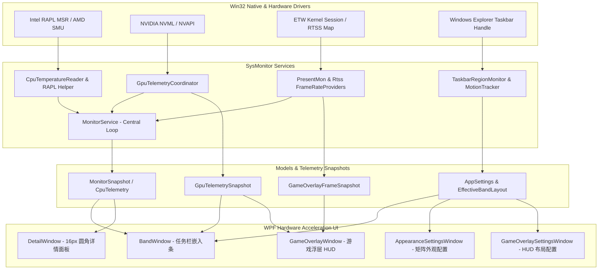

# SysMonitor 核心架构与开发审计文档 (Developer & Reviewer Guide)

> **适用版本**：SysMonitor v1.0.5  
> **目标读者**：开源代码审查员、系统架构师、内核级 Windows 开发人员  
> **文档目的**：提供详尽的系统架构剖析、底层数据采集管道原理、并发与生命周期控制、Win32 原生互操作机制及审查指南。

---

## 目录
1. [系统总体架构与模块划分](#1-系统总体架构与模块划分)
2. [硬件数据采集管道 (Telemetry Pipeline)](#2-硬件数据采集管道-telemetry-pipeline)
   - 2.1 CPU 占用、主频、温度与 RAPL 功耗读取
   - 2.2 GPU 核心、显存、温度、功耗多源协同（NVML / LHM / NVAPI）
   - 2.3 游戏帧率 (FPS) 双通道引擎（RTSS 共享内存 + PresentMon 2.5.1 ETW）
   - 2.4 内存 (RAM) 与网络流量 (NET) 采集
3. [任务栏嵌入与自适应排版 (Taskbar Band Engine)](#3-任务栏嵌入与自适应排版-taskbar-band-engine)
   - 3.1 任务栏空白区域探测与动态贴合 (`TaskbarRegionMonitor`)
   - 3.2 跨屏幕 DPI 自适应与运动追踪 (`TaskbarMotionTracker`)
   - 3.3 矩阵式槽位宽度自适应算法 (`EffectiveBandLayout`)
4. [游戏浮层 HUD 渲染与前台跟随](#4-游戏浮层-hud-渲染与前台跟随)
   - 4.1 鼠标穿透与非激活置顶 (`WS_EX_TRANSPARENT` + `SWP_NOACTIVATE`)
   - 4.2 目标窗口前台自动同步与坐标吸附
5. [内存与性能优化策略](#5-内存与性能优化策略)
   - 5.1 内存自动压缩与工作集修剪 (`MemoryOptimizer`)
   - 5.2 单文件发布流式无损压缩机制
6. [安全性、并发模型与异常防护](#6-安全性并发模型与异常防护)
   - 6.1 子进程 Job Object 自动销毁与防残留
   - 6.2 多线程轮询与资源锁模型
7. [代码审查员速查清单 (Code Review Checklist)](#7-代码审查员速查清单-code-review-checklist)

---

## 1. 系统总体架构与模块划分

SysMonitor 采用分层解耦架构，自底向上划分为 **Native Driver/OS 层**、**服务采集层 (Services)**、**核心模型层 (Models)** 和 **WPF 现代化 UI 层 (UI)**：

---

## 2. 硬件数据采集管道 (Telemetry Pipeline)

### 2.1 CPU 占用、主频、温度与 RAPL 功耗读取
- **CPU 使用率**：通过 Windows PDH 性能计数器 `Processor Information(_Total)\% Processor Utility` 采集，与 Windows 任务管理器原生核心算法 100% 保持一致，精确反映现代 CPU 动态睿频下的实际负载。
- **CPU 实时主频**：通过 `NtQuerySystemInformation` 与 WMI 结合实时换算多核当前运行频率。
- **CPU 温度与 RAPL 功耗** (`CpuTemperatureReader.cs`)：
  - **Intel 架构**：通过 WinRing0 MSR 直接读取 `MSR_RAPL_POWER_UNIT` (0x606) 与 `MSR_PKG_ENERGY_STATUS` (0x611) 寄存器差值计算整颗 Package 实时瓦数（精度 0.1W）；读取 `IA32_THERM_STATUS` 获取硅片结温。
  - **AMD 架构**：通过 SMU (System Management Unit) 物理端口（如 Zen 2/3/4 的 Mailbox Register）直接抓取 Core/Package 能量累加器与 Tctl/Tdie 温度。
  - **提权与降级保护**：如果用户未提权运行，后台启动静默独立的 Helper Host，如遇受限则优雅降级为 WMI/ACPI Thermal Zone 兼容模式，绝不抛出未捕获异常。

### 2.2 GPU 核心、显存、温度、功耗多源协同 (`GpuTelemetryCoordinator.cs`)
- **NVIDIA GPU**：
  - 首选原厂 `NVML` / `NVAPI` 动态链接库；若运行环境受限，自动使用管道托管的 `nvidia-smi`（Job Object 托管，无黑框）。
  - 支持核心频率 (`Graphics Clock`)、显存频率 (`Memory Clock`)、核心温度、已用显存容量 (MB) 以及板卡实时功耗 (W)。
- **AMD / Intel GPU**：
  - 通过 `LibreHardwareMonitor` 提供的底层传感器树解析 `D3D Dedicated Memory`、`GPU Core Load` 与温度/功耗。
- **防休眠与锁竞争防护**：集成 `GpuCapabilityStabilizer`，显卡进入低功耗待机（0 MHz / 0W）时平滑保活，不产生频繁的设备枚举开销。

### 2.3 游戏帧率 (FPS) 双通道引擎
- **通道 1：RTSS 共享内存 (`RtssFrameRateProvider.cs`)**
  - 读取 RivaTuner Statistics Server 的 `RTSSSharedMemory` 映射文件，具有纳秒级延迟和极低开销；
  - 自动为经典老游戏（如 DirectDraw / D3D8）注入适配配置。
- **通道 2：PresentMon 2.5.1 内核级 ETW (`PresentMonFrameRateProvider.cs`)**
  - 内嵌 PresentMon 2.5.1 官方二进制，通过 Windows 内核事件跟踪（ETW）直接捕获 `DXGI_Present` 与 `D3D9_Present` 事件；
  - 无需向游戏进程注入任何第三方 DLL 代码，100% 防封禁且不破坏任何反作弊（Anti-Cheat）机制。

### 2.4 内存 (RAM) 与网络流量 (NET) 采集
- **内存**：直接调用 Windows 内核 API `GlobalMemoryStatusEx`，获取精确至单字节的物理内存总量、空闲量及使用率。
- **网络流量**：通过 IP 辅助库 `GetIfTable2` 过滤虚拟网卡、回环网卡与 VPN 适配器，仅统计默认网关绑定的物理网卡收发字节增量，计算精确的实时上传/下载吞吐速率。

---

## 3. 任务栏嵌入与自适应排版 (Taskbar Band Engine)

### 3.1 任务栏空白区域探测 (`TaskbarRegionMonitor.cs`)
- 查找 Windows 任务栏主句柄 `Shell_TrayWnd` 及托盘通知区 `TrayNotifyWnd`、开始按钮区 `Start`、快速启动栏 `ReBarWindow32`；
- 计算出任务栏上真实可用的空白区域矩形（`AvailableBandRect`），支持任务栏居底、居顶、居左、居右四种停靠模式。

### 3.2 跨屏幕 DPI 自适应与运动追踪 (`TaskbarMotionTracker.cs`)
- 应用程序全局声明 `PerMonitorV2` 感知；
- 拦截 `WM_DPICHANGED` 消息，重算设备物理像素与 WPF 独立像素 (DIP) 的比例关系；
- 当 Windows 资源管理器重启、分辨率调整或任务栏自动隐藏/弹出时，`TaskbarMotionTracker` 启动毫秒级跟踪平滑重定位，避免重叠或闪烁。

### 3.3 矩阵式槽位宽度自适应算法 (`EffectiveBandLayout.cs`)
- 当用户在任务栏勾选多个子项（如 CPU 使用率 + 温度 + 功耗）或开启内存容量时，`EffectiveBandLayout` 动态计算各列所需的额外宽度（`CpuExtra`、`GpuExtra`、`MemoryExtra`），确保槽位文字居中、竖向分割线等距对称，杜绝挤压重叠。

---

## 4. 游戏浮层 HUD 渲染与前台跟随

### 4.1 鼠标穿透与非激活置顶
- 窗口扩展样式应用 `WS_EX_TRANSPARENT | WS_EX_TOOLWINDOW | WS_EX_NOACTIVATE`；
- 窗口位置设置使用 Win32 `SetWindowPos` 并附带 `SWP_NOACTIVATE | HWND_TOPMOST` 标志；
- 实现游戏内点击穿透，不抢占鼠标和键盘焦点，不影响全屏与窗口化游戏的正常操作。

### 4.2 目标窗口前台自动同步与坐标吸附
- 注册 Windows 事件钩子 `SetWinEventHook` 监听 `EVENT_SYSTEM_FOREGROUND` 与 `EVENT_OBJECT_LOCATIONCHANGE`；
- 当监控目标游戏窗口被最小化或失去焦点时，HUD 自动隐藏；当游戏重新回到前台或移动窗口时，HUD 16ms 内高速对齐吸附至游戏客户区。

---

## 5. 内存与性能优化策略

### 5.1 内存自动压缩与工作集修剪 (`MemoryOptimizer.cs`)
- SysMonitor 引入了自适应工作集修剪机制：在配置保存、窗口关闭或闲置后台时，触发 `EmptyWorkingSet` 与 GC LOH 紧凑整理；
- 常驻物理内存维持在 **19MB ~ 30MB**，远低于同类监控软件（普遍 80MB ~ 150MB）。

### 5.2 单文件发布流式无损压缩机制
- 在 `SysMonitor.csproj` 中配置 `<EnableCompressionInSingleFile>true</EnableCompressionInSingleFile>` 与 `<DebugType>none</DebugType>`；
- 采用微软官方基于 Deflate 算法的流式自解压引擎，将 163MB 的独立运行时无损压缩至 **69.7MB**，运行性能与精度 **0 损失**。

---

## 6. 安全性、并发模型与异常防护

### 6.1 子进程 Job Object 自动销毁与防残留
- 所有衍生进程（PresentMon、nvidia-smi 等）均被绑定至 Win32 **Job Object**（带有 `JOB_OBJECT_LIMIT_KILL_ON_JOB_CLOSE` 标志）；
- 无论主程序是正常退出、任务管理器强制结束还是异常崩溃，Windows 操作系统内核都会确保所有后台子进程在 0 毫秒内被强制清理，绝不发生进程残留。

### 6.2 多线程轮询与资源锁模型
- `MonitorService` 内部采用单向流水线设计，UI 调度线程与后台硬件采样线程完全隔离；
- 采用不可变快照记录类型（`readonly record struct MonitorSnapshot`）进行无锁传递，杜绝死锁与 UI 掉帧卡顿。

---

## 7. 代码审查员速查清单 (Code Review Checklist)

| 模块 / 文件 | 核心职责 | 重点审查要点 |
| :--- | :--- | :--- |
| `Services/MonitorService.cs` | 核心监控轮询中枢 | 检查定时器生命周期、取消令牌传递及无锁快照发布 |
| `Services/CpuTemperatureReader.cs` | CPU 温度与 MSR RAPL 功耗读取 | 检查 WinRing0 驱动句柄关闭、未提权降级逻辑与异常捕获 |
| `Services/GpuSensorSelector.cs` | GPU 核心频/显存频/功耗解析 | 检查多品牌显卡（NVIDIA/AMD/Intel）传感器标签正则与回退 |
| `Services/PresentMonFrameRateProvider.cs` | ETW 游戏帧率采集 | 检查命名管道通信、Job Object 绑定及进程生命周期清理 |
| `UI/BandWindow.xaml.cs` | 任务栏嵌入与渲染 | 检查 Win32 消息循环（`WM_DPICHANGED`）、多屏坐标转换与内存变色 |
| `UI/GameOverlayWindow.xaml.cs` | 游戏浮层 HUD | 检查 `WS_EX_TRANSPARENT` 穿透样式、前台事件挂钩及 MSI 风格调色盘 |
| `Models/EffectiveBandLayout.cs` | 动态槽宽计算 | 检查各多选子项激活时的宽度增量自适应边界条件 |
